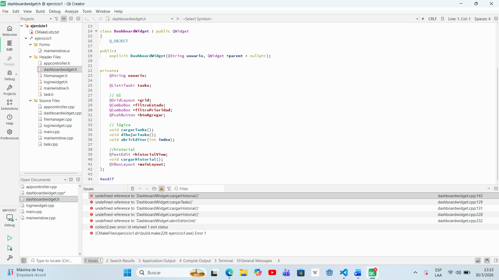

# 📂 Ejercicio 01 - Planificador de Trabajos Prácticos
## 📝Descripción
 Aplicación en Qt para planificar trabajos prácticos, con login, seguimiento de entregas y persistencia local.
## 📌Objetivos
Programar una aplicación en QT que funcione correctamente, tenga una UI usable, con una persistencia correcta y con un código organizado.
## ✔️Alcance Mínimo
* Login con validación y usuarios locales en archivo (CSV o JSON).
* Recordar sesión de forma local (archivo simple) para no pedir login en el mismo equipo. Persistencia de 5 minutos (simulación de sesión).
* Ventana principal con tablero de trabajos prácticos en grilla (QGridLayout), con cada fila armada con QLabel y botones de acciones, y filtro por estado/prioridad.
* Alta/edición/eliminación de trabajos prácticos.
* Editor de notas asociado al trabajo práctico con guardado manual.
* Historial de acciones visible en la UI y guardado en archivo.
## 🧰 Condiciones Técnicas 
* No usar QML.
* Usar QWidget (no QMainWindow).
* Organizar el código en clases (no todo en main.cpp).
## 💻 Instrucciones de compilación y ejecución
1- Abrir el proyecto en Qt Creator
2- Compilar el proyecto
3- Ejecutar la aplicación
## 🏠Arquitectura

## 📷 Capturas Solicitadas
### Loging

### Pantalla Principal

### Filtro por Prioridad

### Filtro por Estado

